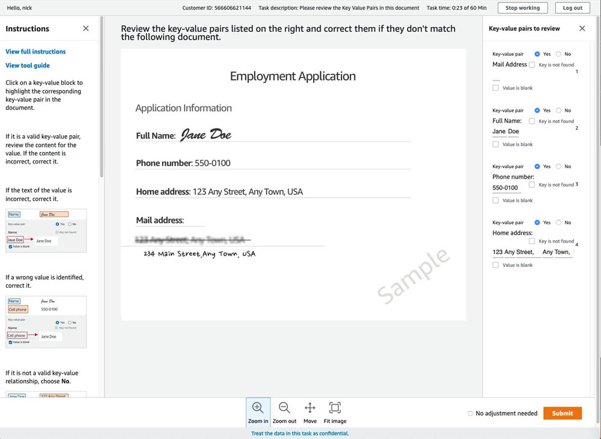

# Processing PDF documents with a human loop with Amazon Textract and Amazon A2I

## Prerequisites

1. Node.js: https://nodejs.org/en/download/
2. Python: https://www.python.org/downloads/
3. AWS Command Line Interface (AWS CLI)—for instructions, see Installing the AWS CLI: https://aws.amazon.com/cli/

## Deployment

The following code deploys the reference implementation in your AWS account. The solution deploys different components, including an S3 bucket, Step Functions, an Amazon Simple Queue Service (Amazon SQS) queue, and AWS Lambda functions using the AWS Cloud Development Kit (AWS CDK), which is an open-source software development framework to model and provision your cloud application resources using familiar programming languages.

1. Install AWS CDK:
```
npm install -g aws-cdk
```
2. Download the repo to your local machine:
```
git clone https://github.com/livein21st/amazon-textract-a2i-pdf/tree/nirav_branch
```
3. Go to the folder amazon-textract-a2i-pdf and enter the following command:
```
pip install -r requirements.txt
```
4. Bootstrap AWS CDK:
```
cdk bootstrap
```
5. Deploy:
```
cdk deploy
```
6. Create a private team: https://docs.aws.amazon.com/sagemaker/latest/dg/sms-workforce-management.html

7. Add team-member's email in the private workforce: Amazon SageMaker > Labeling workforces > "YOUR_PRIVATE_TEAM_NAME" > Workers > Add workers to Team

8. Create a human review workflow: https://console.aws.amazon.com/a2i/home?region=us-east-1#/human-review-workflows

9. Create a file config.py file in the project root folder. Paste the below code with the ARN of the human review workflow.
    For example:
    ```python
    #!/usr/bin/env python
    credentials = {
         hr-workflow-arn = "COPY_HUMAN_REVIEW_WORKFLOW_ARN_HERE"
    }
    ```
10. Run "cdk deploy" to update the solution with human review workflow arn.

11. Go S3 bucket (console) and open newly created bucket for the flow. (Bucket name should be: pdfparse-pdfparsexxxxxxxx-xxxxxxxxxxxxx)
    - in the bucket to go permission tab and edit/update Cross-origin resource sharing (CORS) as follows.
    ```json
    [{
    "AllowedHeaders": [],
    "AllowedMethods": ["GET"],
    "AllowedOrigins": ["*"],
    "ExposeHeaders": []
    }]
    ```

## Testing the workflow
1. Create a folder named uploads in the S3 bucket that was created by CDK deployment (Example: pdfparse-pdfparsexxxxxxxx-xxxxxxxxxxxxx)

2. Upload the PDF document to the uploads folder. For example, uploads/Sampledoc.pdf

3. On the Amazon SageMaker console, choose Labeling workforces.

4. On the Private tab, choose the link under Labeling portal sign-in URL.


5. Sign in with the account you configured with Amazon Cognito.

If the document required a human review, a job appears under Jobs section .

6. Select the job you want to complete and choose Start working.


In the reviewer UI, you see instructions and the first document to work on. You can use the toolbox to zoom in and out, fit image, and reposition document. See the following screenshot.



This UI is specifically designed for document-processing tasks. On the right side of the preceding screenshot, the key-value pairs are automatically pre-filled with the Amazon Textract response. As a worker, you can quickly refer to this sidebar to make sure the key-values are identified correctly (which is the case for this post).

When you select any field on the right, a corresponding bounding box appears, which highlights its location on the document. See the following screenshot.


In the following screenshot, Amazon Textract didn’t identify Mail Address. The human review workflow identified this as an important field. Even though Amazon Textract didn’t identify it, the worker task UI asks you to enter d details on the right side.


There may be a series of pages you need to submit based on the Amazon Textract confidence score ranges you configured. When you finish reviewing them, continue with steps below.

7. When you complete the human review, go to the S3 bucket you used earlier (Example: pdfparse-pdfparsexxxxxxxx-xxxxxxxxxxxxx)

8. In the complete folder, choose the folder that has the name of input document (Example: uploads-Sampledoc.pdf-b5d54fdb75b143ee99f7524de56626a3).

That folder contains output.json, which contains all your key-value pairs and table's row data.


The following screenshot shows the content of an example output.json file.


## Clean Up
1. First you'll need to completely empty the S3 bucket that was created.
2. Finally, you'll need to run:
```
cdk destroy
```

## Security

See [CONTRIBUTING](CONTRIBUTING.md#security-issue-notifications) for more information.

## License

This library is licensed under the MIT-0 License. See the LICENSE file.

